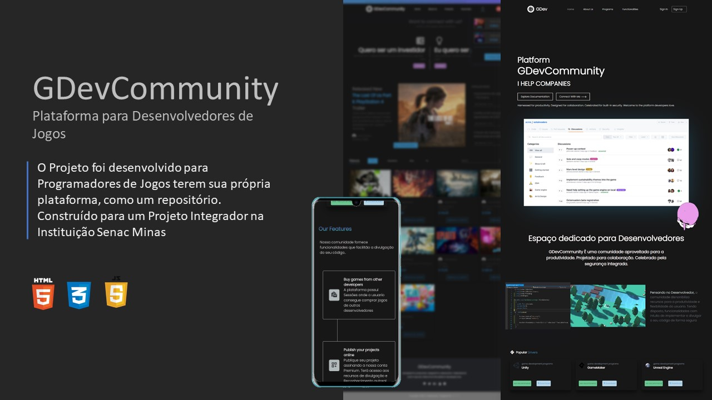

<h1 align="center">Game Store</h1>

 👩🏻‍🚀 Meu primeiro projeto no Repositório 👩🏻‍🚀

## 🚀 Tecnologias

Esse projeto foi desenvolvido com as seguintes tecnologias

- HTML e CSS
- JavaScript
- git e Github
- Node.js

## 💻 Projeto

Projeto foi desenvolvido para Programadores de Jogos terem sua própria plataforma, como um repositório.

## 👩🏻‍🎓 Inspiração

Projeto Integrador - Senac Minas |
Curso Técnico em Informática